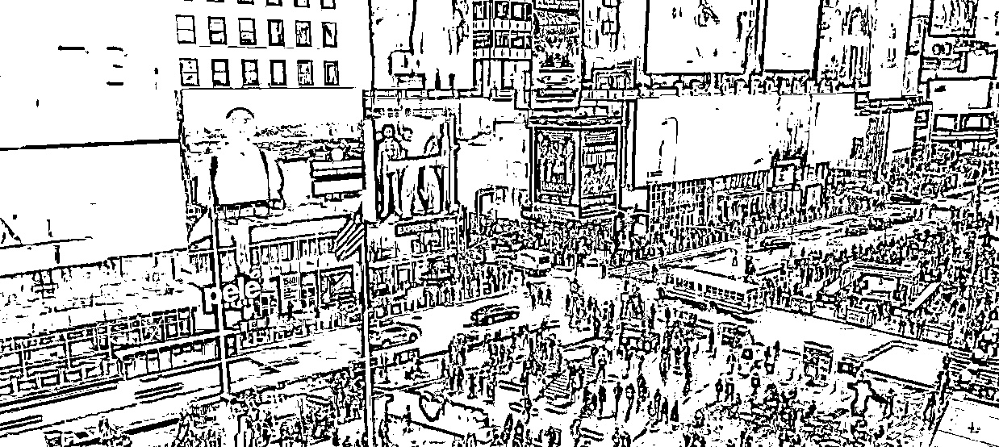
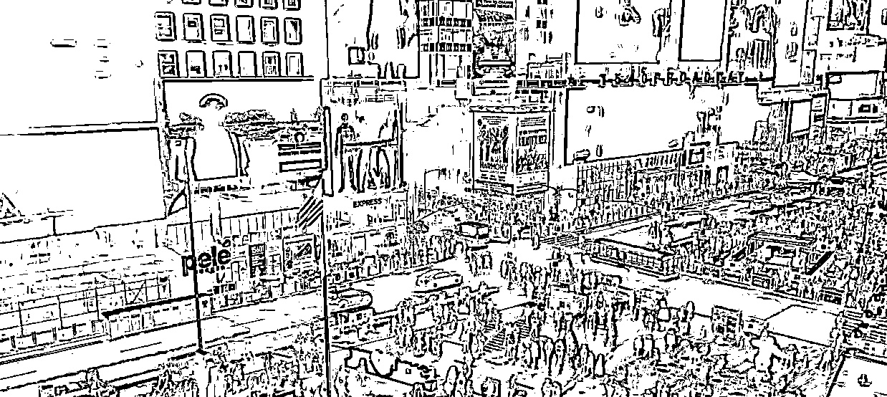
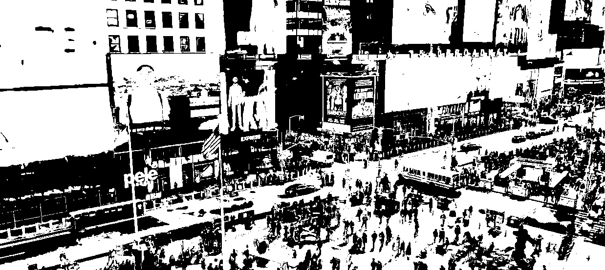
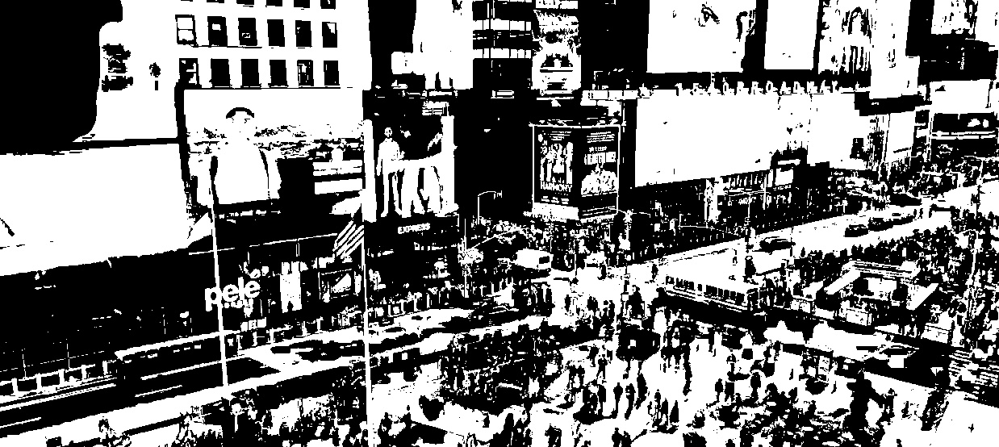

# Лабораторная работа 1

## Цель
Научиться реализовывать один из простых алгоритмов обработки изображения

## Вариант
Бинаризация с адаптивным порогом

## Теория
Метод бинаризации с адаптивным порогом - это метод обработки изображений, который позволяет автоматически находить пороговое значение для каждого пикселя или области пикселей в изображении. Этот метод особенно полезен в случаях, когда освещение на изображении неоднородно или когда фоновый уровень яркости переменен, в результате чего использование фиксированного порогового значения приводит к неудовлетворительным результатам.

Основная идея метода бинаризации с адаптивным порогом заключается в том, чтобы вычислить порог для каждой области изображения, основываясь на локальной структуре яркости в этой области. Это позволяет адаптировать порог к местным особенностям изображения, что делает его более гибким и способным к обработке разнообразных сценариев.

Существует несколько способов реализации адаптивной бинаризации. Некоторые из самых популярных методов включают вычисление порога на основе среднего или медианного значения интенсивности пикселей в окрестности каждого пикселя, использование методов гауссовской фильтрации для выделения текстурных особенностей

## Описание программы

### Алгоритм бинаризации с адаптивным порогом с помощью Numpy
1. Пребразование изображение в оттенки серого, бинаризация и создание ядра аналогично предыдущему способу
2. Реализация алгоритма:
```
def my_adaptive_thresh_mean(img, region, C=5):
    max_r = img.shape[0]
    max_c = img.shape[1]
    half_region = (region - 1) / 2
    res_img = []
    for r in range(max_r):
        new_line = []
        start_r = int(0 if (r - half_region) < 0 else r - half_region)
        end_r = int(r + half_region if (r + half_region) < max_r else max_r)
        for c in range(max_c):
            start_c = int(0 if (c - half_region) < 0 else c - half_region)
            end_c = int(c + half_region if (c + half_region) < max_c else max_c)
            region = img[start_r:end_r, start_c:end_c]
            treshold = region.mean() + C
            adaptive = 255 if img[r, c] < treshold else 0
            new_line.append(np.uint8(adaptive))
        res_img.append(new_line)
    return np.array(res_img)
```

## Результаты
Кадр исходного видео:


Результат применения CV2 бинаризации с порогом 9:


Результат применения собственного алгоритма бинаризации Numpy с порогом 9:


Результат применения CV2 бинаризации с порогом 299:


Результат применения собственного алгоритма бинаризации Numpy с порогом 299: 


Сравнение производительности алгоритмов

1) Алгоритм CV2

    Frame resolution: 1238.0 х 554.0
    Execution time: 11.4314s
    Number of frames: 550.0000
    Frames per second: 48.1130
    Second for one frame: 0.0208

2) Собственный алгоритм Numpy

    Frame resolution: 1238.0 х 554.0
    Execution time: 34799.6202s
    Number of frames: 275.0000
    Frames per second: 0.0079
    Second for one frame: 126.5441

## Вывод
В результате выполнения лабораторной работы удалось ознакомиться с процессом работы платформы Jetson и реализовать метод бинаризации с адаптивным порогом. Также проведено сравнение производительности существующего алгоритма бинаризации в библиотеке CV2 и собственного. Производительность разработанного алгоритма с помощью Numpy уступает CV2 в несколько раз.
