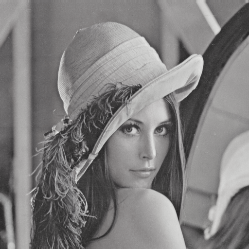
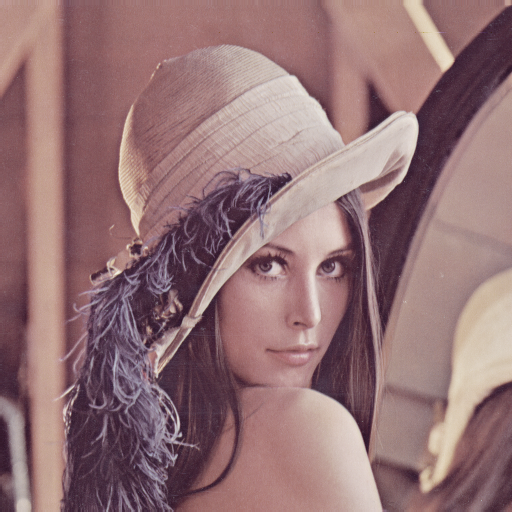
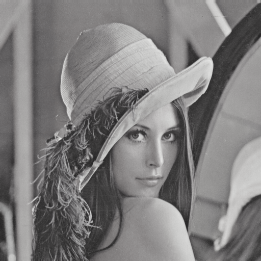
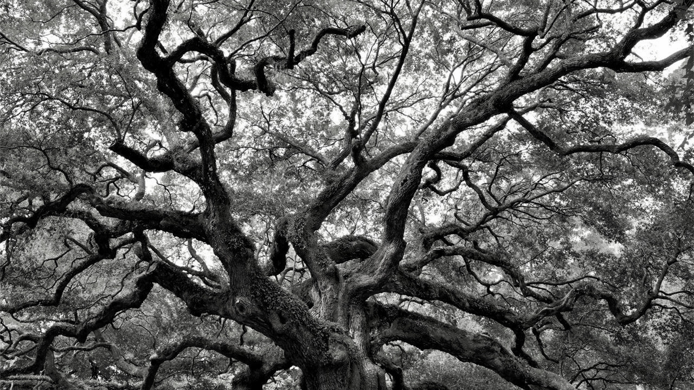
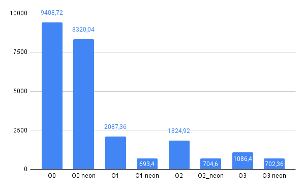
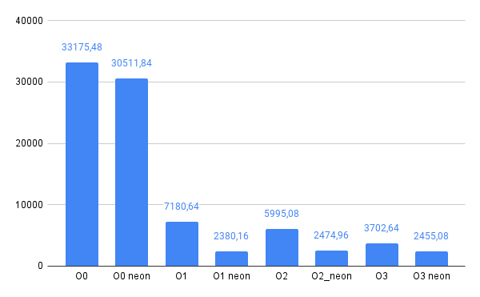

# Лабораторная работа 2

## Цель
Изучить основы оптимизации и векторизации алгоритмов компьютерного зрения на базе процессорной системы ARM Cortex A57 MPCore + NEON.

## Вариант
Уменьшение насыщенности изображения (взвешенное суммированиес grayscale)

## Теория
Уменьшение насыщенности изображения (взвешенное суммирование в grayscale) - это процесс изменения яркости и насыщенности цветов в изображении, чтобы оно выглядело менее насыщенным и более монохромным. В этом процессе каждый пиксель изображения преобразуется в оттенки серого, используя определенные веса для каждого канала цвета. Затем значения RGB-каналов умножаются на соответствующие веса и складываются, чтобы получить новое значение яркости пикселя. 

Этот процесс применяется к каждому пикселю изображения, чтобы получить новое изображение с меньшей насыщенностью и более монохромным видом.

## Описание программы

### Алгоритм уменьшение насыщенности
1. Без векторизации:
```
        void rgb_with_graymask(const uint8_t* rgb, uint8_t* reduced, int num_pixels, int gr_weight)
        {
            	auto t1 = chrono::high_resolution_clock::now();
                gr_weight = gr_weight % 256;
                int img_weight = 255 - gr_weight;

            	for(int i=0; i<num_pixels; i+=3, rgb+=3) {
            		int v = (rgb[0] + rgb[1] + rgb[2])/3;
                    reduced[i] = (img_weight*rgb[0] + gr_weight*v) >> 8;
                    reduced[i+1] = (img_weight*rgb[1] + gr_weight*v) >> 8;
                    reduced[i+2] = (img_weight*rgb[2] + gr_weight*v) >> 8; 
            	}
            	auto t2 = chrono::high_resolution_clock::now();
            	auto duration = chrono::duration_cast<chrono::microseconds>(t2-t1).count();
            	cout << "rgb_with_graymask\t" << to_string(gr_weight) << "\t" << duration << endl;
        }
```

2. С векторизацией:
```
    void rgb_with_graymask_neon8(const uint8_t* rgb, uint8_t* reduced, int num_pixels, int gr_weight) {
        gr_weight = gr_weight % 256;
        int img_weight = 255 - gr_weight;
        	num_pixels /= 8;
        	uint8x8_t gr_w = vdup_n_u8(gr_weight);
        	uint8x8_t img_w = vdup_n_u8(img_weight);
        	uint8x8_t w_gr = vdup_n_u8(85);

        	uint16x8_t temp;
        	uint8x8_t temp_result;
        	auto t1_neon = chrono::high_resolution_clock::now();
        	for(int i=0; i<num_pixels; i+=3, rgb+=8*3, reduced+=8*3) {
                uint8x8x3_t src = vld3_u8(rgb);
                temp = vmull_u8(src.val[0], w_gr);
                temp = vmlal_u8(temp, src.val[1], w_gr);
                temp = vmlal_u8(temp, src.val[2], w_gr);
                temp_result = vshrn_n_u16(temp, 8);

                src.val[0] = vshrn_n_u16(
                        vmull_u8(src.val[0], img_w) + vmull_u8(temp_result, gr_w), 8);
                src.val[1] = vshrn_n_u16(
                        vmull_u8(src.val[1], img_w) + vmull_u8(temp_result, gr_w), 8);
                src.val[2] = vshrn_n_u16(
                        vmull_u8(src.val[2], img_w) + vmull_u8(temp_result, gr_w), 8);

                vst3_u8(reduced, src);
        	}
        	auto t2_neon = chrono::high_resolution_clock::now();
        	auto duration_neon = chrono::duration_cast<chrono::microseconds>(t2_neon-t1_neon).count();
        	cout << "rgb_with_graymask_neon8\t" << to_string(gr_weight) << "\t" << duration_neon << endl;
    }
```

## Результаты

512х512px

|  Исходное                       | 50                                             | 150                                             | 250                                             |
|---------------------------------|------------------------------------------------|-------------------------------------------------|-------------------------------------------------|
| |      |      |      |
| | | | |


1280х720px

|  Исходное                       | 50                                             | 150                                             | 250                                             |
|---------------------------------|------------------------------------------------|-------------------------------------------------|-------------------------------------------------|
| |      |      |      |
| | | | |


Время выполнения преобразования в зависимости от уровня оптимизации компиляции О:

512х512px




1280х720px



## Вывод
В результате выполнения лабораторной работы удалось ознакомиться с возможностью векторной обработки изображений на процессоре ARM
