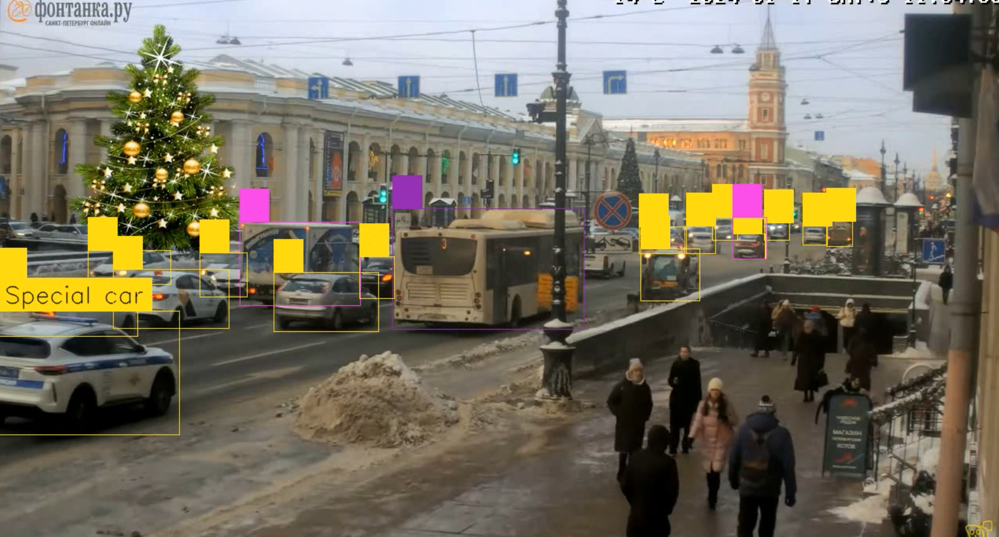
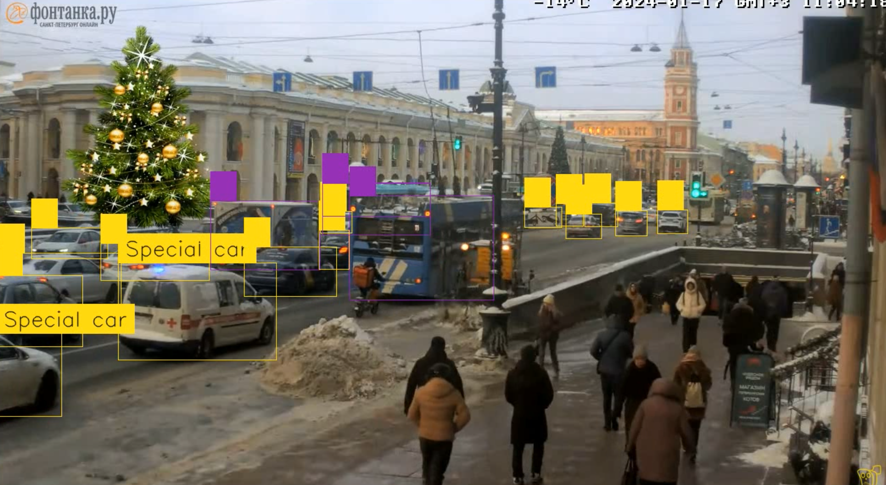
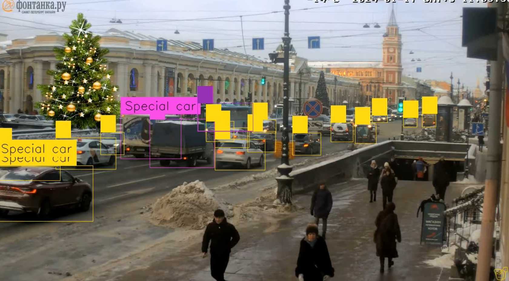
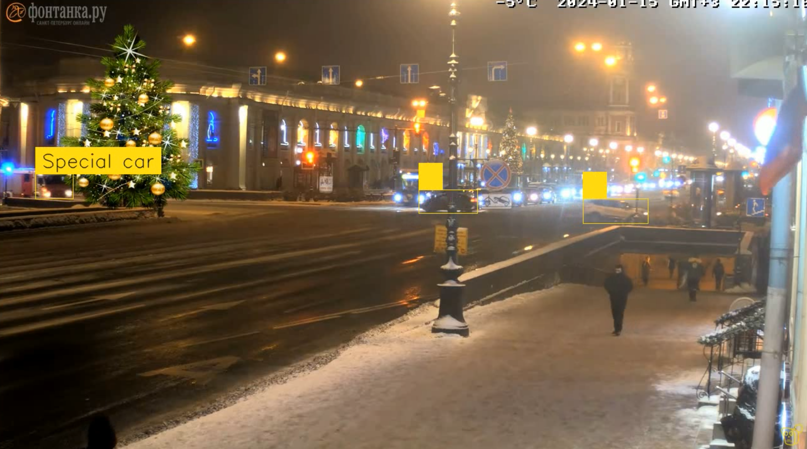
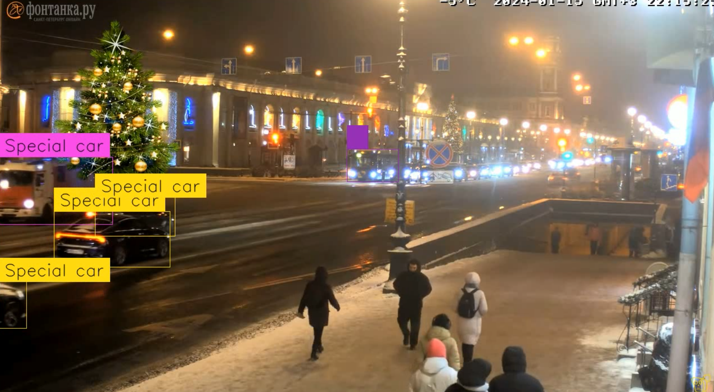
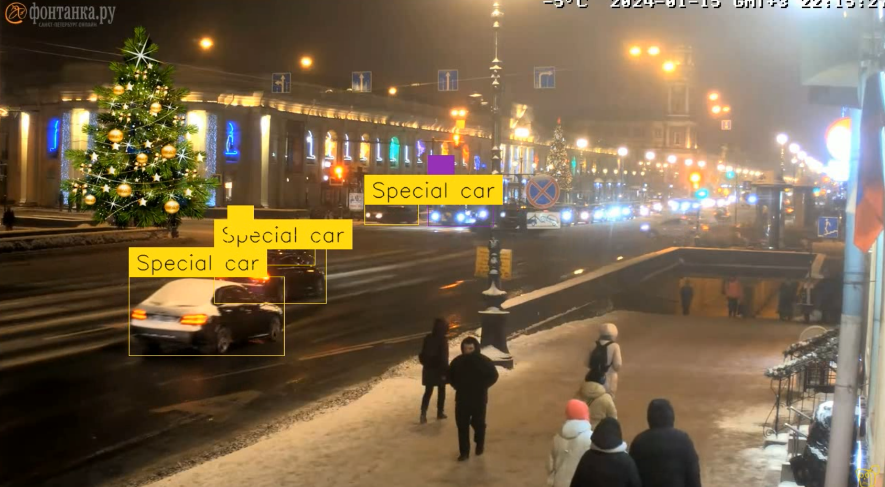
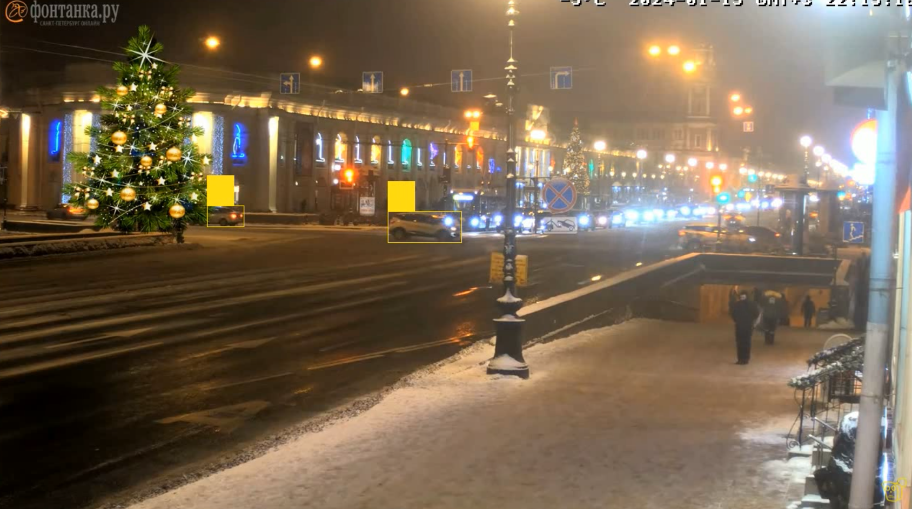
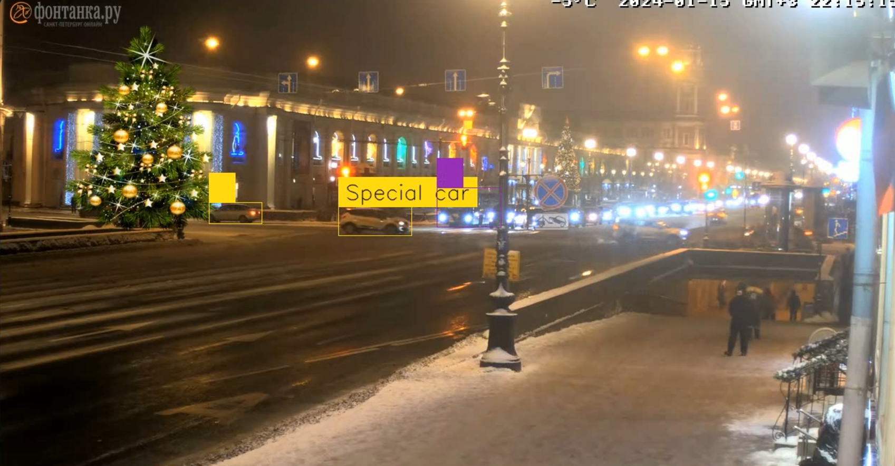

# Лабораторная работа №4

## Цель работы

Создать прикладную систему компьютерного зрения на базе Jetson Nano.

## Задание

1. Выбрать и зафиксировать в Google таблице курса тему проекта.
2. Разработать требования к системе.
3. Разработать архитектуру системы.
4. Реализовать систему обработки видео с использованием ИИ и алгоритмов
компьютерного зрения.
5. Оценить потребление ресурсов при функционировании системы и технические
характеристики (быстродействие, а также специфичные для проекта значения.
например, ошибку классификации, требования к характеру изображения и т. д.).

### Инструментальные средства

Лабораторная работа выполняется на языке Python с использованием библиотек pytorch,
torchvision, TensorRT (альтернативно может быть использован язык C++ и
соответствующие API библиотек), в качестве платформы используется одноплатный
компьютер Jetson Nano.

## Теоретическая база

### Выбранная тема проекта

В качестве темы работы была выбрана "Обнаружение машин спецслужб

### Требование к системе: 
1. Работа в реальном времени;
2. Определение машин разных спецслужб
3. Модель должна работать на видео, снятых в ночное и дневное время.

### Архитектура системы

Для выполнения поставленных требований был исопльзовать датасет с изображениями автомобилей спецслужб, доступный по ссылке

[Link text](https://www.kaggle.com/datasets/k1rsn7/dataset-for-classification-of-specialty-cars)

Данный датасет исопльзуется для обучения сети densenet169, который классифицирует изображение по признаку машина спецслужб или обычная.

После обучения модели классификации необходима модель позволяющая детектировать объекты на видео. В работе будем исопльзовать предобученную модель yolov8x, позволяющая детектировать на видео многие классы объектов, из которых мы оставим только 'car', 'bus' и 'truck'.

Последним действием передаем обнаруженные объекты модели densenet169 и на основе полученного клаcса меняем лейблы в результате

Данный способ позволяет отказаться от ручной разметки данных для YOLOv8 модели.

## Результаты работы и тестирования системы

Обучение классификатора производилось на 2 датасетах
  * из 200 изображений
  * из 3000 изображений

После применения алгоритма поличлись следующие результаты

Рис.1 Результат определения машины ДПС в дневное время на модели с большим датасетом

Рис.2 Результат определения машины Скорой помощь в дневное время на модели с большим датасетом

Рис.3 Результат определения при большом количестве автомобилей в дневное время на модели с большим датасетом

Рис.4 Результат определения пожарной машины в ночное время на модели с большим датасетом

Рис.5 Результат определения пожарной машины в ночное время на модели с малым датасетом

Рис.6 Результат определения пожарной машины в ночное время с большим количеством других автомобилей на модели с большим датасетом

Рис.7 Результат определения пожарной машины в ночное время с большим количеством других автомобилей на модели с малым датасетом

Рис.8 Результат выполнения на кадре без спец машин  в ночное время на модели с большим датасетом

Рис.9 Результат выполнения на кадре без спец машин  в ночное время на модели с малым датасетом

## Вывод

В ходе выпонения работы был реализовн алгоритм машинного зрения, позволяющий детектировать спец автомобили на видео.
Из заданных требований алгоритм позволяет детектировать автомашины разных служб, а также делать это в дневное и ночное время. Скорость обработки изображений не позволяет делать это в реальном времени.

Также можно отметить следующие недостатки и пути их решения:

  * Уменьшить количество ложных срабатываний классификации. Может быть достигнуто увеличением датасета(или доп.преобразовании изображений в существующем датасете) или использованием альтернативной сети
  * Увеличить скорость обработки кадров. Если не брать в расчет запуск модели на более производительном железе, то можно предложить классифицировать объект densenet169 один раз, а далее использовать инструмент YOLO для трекинга объекта. Данный способ позволит уменьшить количество запросов на классификацию, но придется на фрейме искать область, в которой модель классификации дает наиболее достоверный результат.
  * Улучшить качество определения объектов в ночное время. Может быть достигнуто как и в пукте 1 дополнительными преобразованиями датасета в процессе обучения(размыти, зеркалирование и т.д.)

С точки зрения образовательного процесса данная лабораторная работа позволила изучить методы обнаружения объектов, а также в результате анализа недостатков полученной модели узнать о путях улучшения работы алгоритмов компьютерного зрения.
